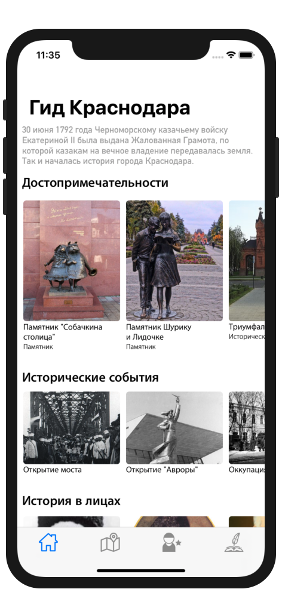
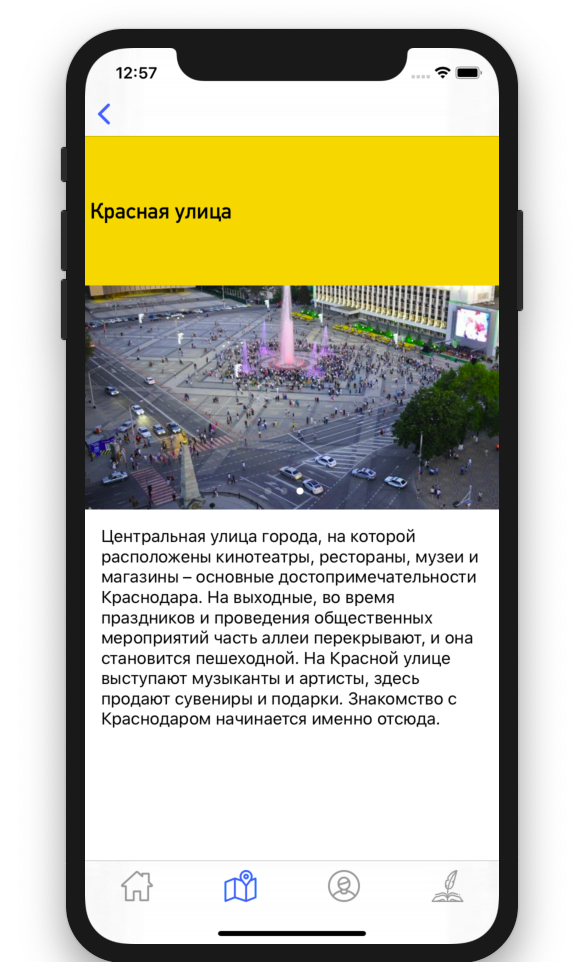

# KrasnodarGuide

A Krasnodar guide iOS app written in Swift.

## Features

* Points on the map.
* Historical figures.
* Historical events of the city.

## Screenshots

## Requirements 

- iOS 12.2+
- Xcode 11.3+
- Swift 4.2+

## Contributing

Please feel free to help out with this project! If you see something that could be made better or want a new feature, open up an issue or send a Pull Request!

